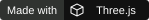
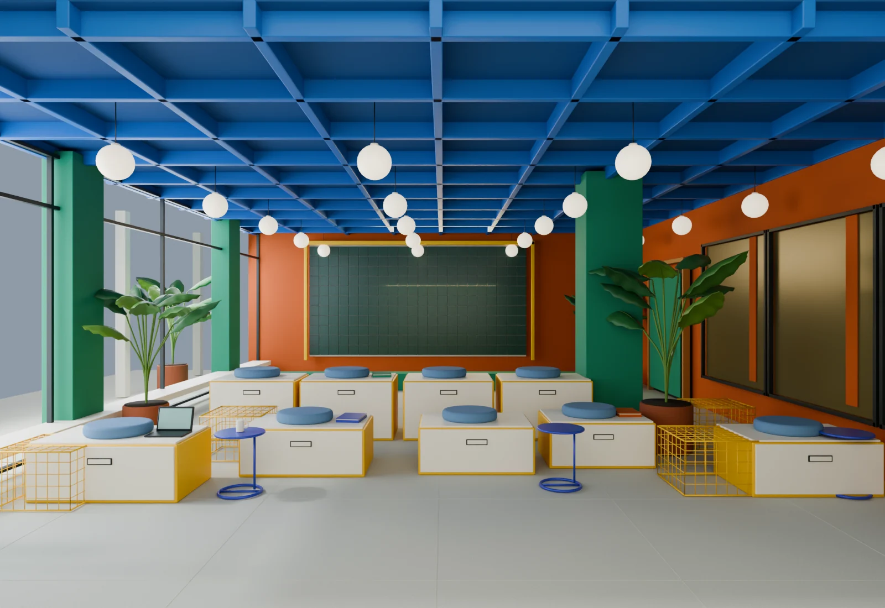

<div align="center">

# worlds.

**Different worlds. One place to explore.**

An independent collection of interactive experiences, each with its own atmosphere, visual identity, and way to play.

[](https://design.renocrypt.com/)
[](https://github.com/renocrypt/design/actions/workflows/pages.yml)
[](https://threejs.org/)

</div>

[](https://design.renocrypt.com/)

## Find your world

Follow a passing light, step inside a typographic gallery, or take the long way through an island lagoon.
Every destination starts with a different idea.

| World | What awaits |
| --- | --- |
| [Noir](https://design.renocrypt.com/worlds/01-noir/) | A night drive in charcoal and bone, guided by pools of light (in progress). |
| [Chrome](https://design.renocrypt.com/worlds/02-chrome/) | Liquid lettering, warm stone, and a little unexpected shine. |
| [Monument](https://design.renocrypt.com/worlds/03-monument/) | An exhibition of the unfinished, with type as its architecture. |
| [Pulse](https://design.renocrypt.com/worlds/04-pulse/) | One button starts a journey through the life of a click. |
| [The lab](https://design.renocrypt.com/lab/) | Interactive studies and ideas taking shape. |
| [Curated](https://design.renocrypt.com/curated/) | Immersive places worth a closer look, beginning with Bikini Atoll. |

## Made to explore

The entrance brings the collection together through a colorful architectural scene, an expanding index, and original animated illustrations.
Each world keeps its own character.

Motion responds to the way you explore.
Keyboard navigation and responsive layouts keep the collection approachable, while still imagery remains available when motion or graphics are unavailable.

## Run locally

Use Node.js 24, the version used by this repository's build workflow.

```sh
cd site
npm ci
npm run dev
```

Open [localhost:5173](http://localhost:5173/).
The site is a static Vite application with TypeScript, Three.js, and GSAP.
It does not need a backend.

To check the production output:

```sh
npm run test:site
npm run build
npm run verify:site
```

## Make something new

The [design direction](docs/CONCEPT.md) describes the collection's visual principles.
The [architecture guide](docs/ARCHITECTURE.md) explains how to add an experience and verify its routes, assets, and publishing metadata.
The [asset guide](docs/ASSETS.md) covers type, imagery, and source material.

GitHub Actions checks and publishes the site when changes reach `main`.
